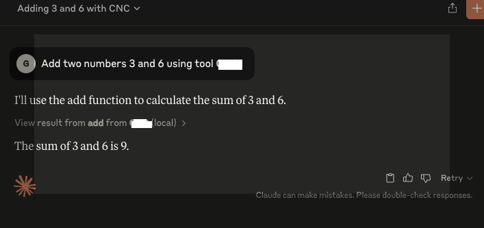

 # MCPServer
A Simple MCP Server for enabling agentic workflow

## Install

```bash
brew install npm
curl -LsSf https://astral.sh/uv/install.sh | sh
git clone -b main https://github.com/ganesh-karthick/MCPServer.git
uv venv --python 3.11.6
source .venv/bin/activate
uv sync
uv --directory  ${GITHOME}/MCPserver run server.py


 ```


```MCPInspector

mcp dev server.py

* MCP Inspector is up and running at http://localhost:5173 🚀
New SSE connection
```


## Claude Desktop Integration
* Add this to ~/Library/Application%20Support/Claude/claude_desktop_config.json

```Claude tool

{
    "mcpServers": {
        "CNC": {
            "command": "<YOUR_HOME>/.local/bin/uv",
            "args": [
                "--directory",
                "<YOUR_HOME>/MCPServer",
                "run",
                "server.py"
            ]
        }
    }
}
```

```Claude desktop

```


